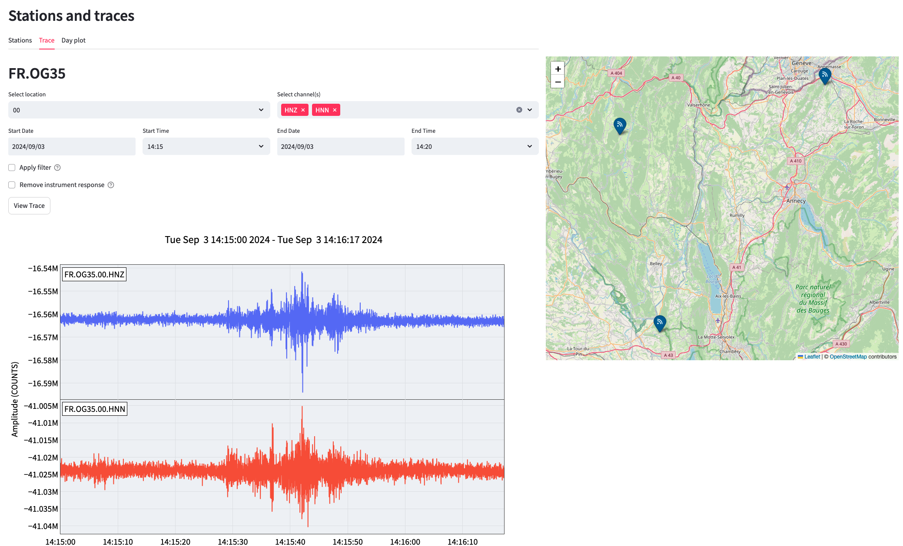
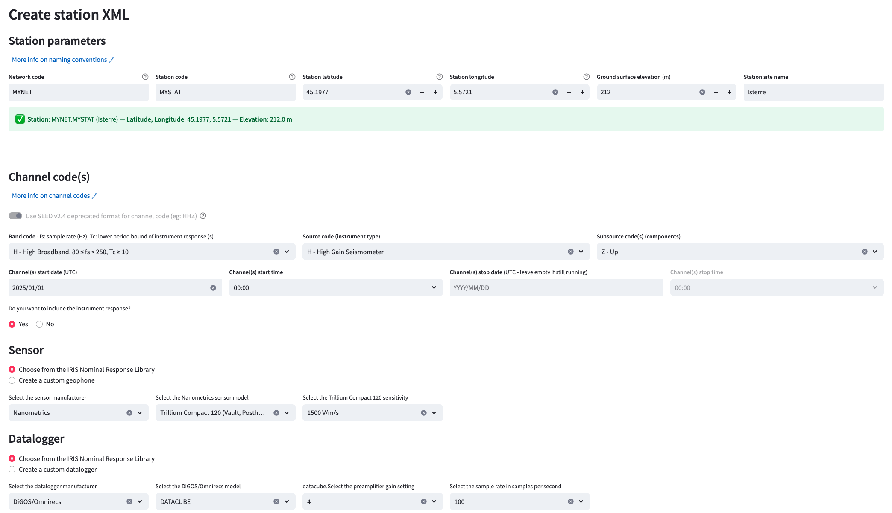
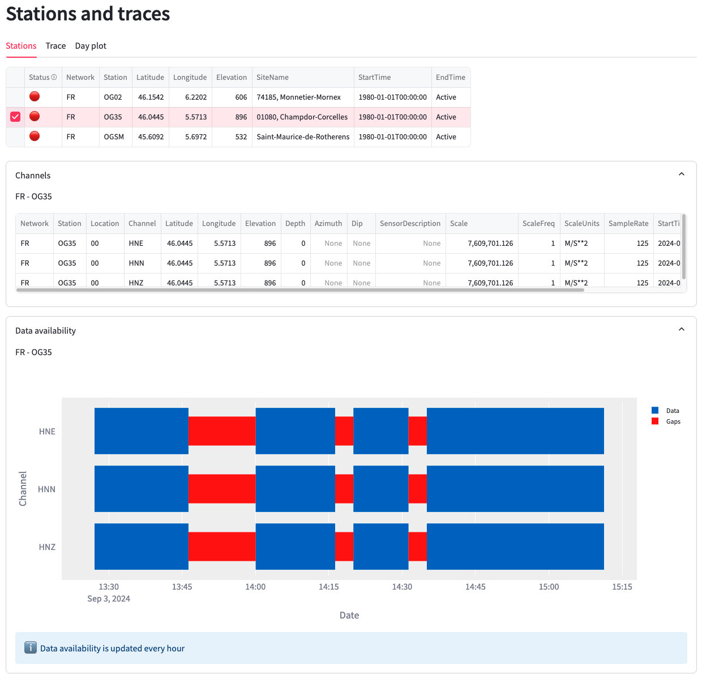

# Netrisk serve 
_(under development)_



Netrisk-serve is a self-hosted web application designed to manage a network of NETRISK stations. The application contains three main components:
 - an FTP server ([vsftpd](https://security.appspot.com/vsftpd.html)) to receive the raw data sent by the NETRISK stations at regular intervals.
 - a [SeisComP](https://www.seiscomp.de/) installation to convert and archive the data into an SDS structure, and to serve [FDSN Web Services](https://www.fdsn.org/webservices/) HTTP requests (stations, dataselect, availability).
 - a user interface built with [Streamlit](https://streamlit.io/) and [Obspy](https://docs.obspy.org/) for managing the stations FTP accounts and metadata ([StationXML](https://www.fdsn.org/xml/station/)), interactive visualization of the data, format conversion, and download.

## Installation
The installation is intended to be user-friendly and platform independent with the use of Docker containers.

### Requirements:

- __Machine:__ access to a self-hosted or cloud-hosted server with admin rights. Recommended minimal configuration: 2 Cores, 16 GB of RAM, and 12GB of storage for the system (plan plenty of extra storage for the data). A static public IP or a domain name pointing to your server IP is needed for the ftp transfers initiated by the stations.

- __Network:__ the firewall should be setup to allow the following network connections: tcp:443 for https, tcp:22 for ssh connection, tcp:21 for passive ftp connection, and a range of ~50 ports between ports 1024 and 65535 for ftp data transfer (tcp:7000-7050 is our default setting). __If using a custom range, you will need to update the corresponding values later on in the _docker-compose.yml_ and _ftp/vsftpd.conf_ file.__

- __Software:__ The two pre-required softwares to be installed are [Git](https://git-scm.com/book/en/v2/Getting-Started-Installing-Git) for the cloning of the current repo and [Docker Engine](https://docs.docker.com/engine/install/) for buiding and running the app containers.

### Configuration:

Clone the current repo and enter the app main directory:
 ```sh
 git clone https://github.com/Thom-P/netrisk-serve.git
 cd netrisk-serve
```

Copy the environment template to create a .env (hidden) file containing your private informations:
```sh
cp .env.template .env
```

Personalize your informations with the terminal editor of your choice (e.g, nano or vim) and keep note of your user interface credentials.
```sh
vim .env
```

### Building and running the app

```sh
sudo docker compose up -d
```
The operation will take several minutes as it downloads and installs all the components of the app containers. The application should be up and running.

## Usage

The web application should be accessible at your server's public IP address or domain name from any internet browser (using https). You need to accept the security warning triggered by your self-signed certificate and authenticate with the user interface credentials previously defined in your .env file.

The home page (_Stations and traces_) lists your currently registered stations (none at installation time). To register a Netrisk station, you need to first create a corresponding FTP account, and a station XML file.

### FTP accounts

The _Manage FTP accounts_ page allows you to create a login and password for every station. These credentials should be included in the Netrisk station's config files to allow FTP connection. Any account can also be deleted to revoke further data upload to the server.

### Station XML files

Every station should have a corresponding [FDSN StationXML file](https://www.fdsn.org/xml/station/). These files contain the metadata describing your station, including every channel, sensor, and digitizer information. These files can be interactively created from the _Create new station XML_ page. You will be able to attach your sensor and digitizer response by selecting instruments from the IRIS NRL library, or by creating custom responses from their known characteristics. After creation of a StationXML file, the corresponding station should be listed in the home page. If the station and server are correctly configured, the status of the station should update to a green light after data reception.   

You can download or delete any of the current StationXML files from the _Manage XML files_ page.



### Channel info and data availability

You can select a given station in the _Stations_ tab of the home page to get a detailed list of its channels and corresponding data availability segments.



### Traces

To view a single- or multi-channel trace of a station within a given time window, go to the _Trace_ tab of the home page and select the location code, channel(s) code, and start and stop date of the time window. You can optionaly apply a bandpass filter and/or remove the station response from the raw data. 

If the number of sample in the segment is larger than 400'000, a low resolution [min/max](https://docs.obspy.org/packages/autogen/obspy.imaging.waveform.WaveformPlotting.html#obspy.imaging.waveform.WaveformPlotting.__plot_min_max) plot of the data will appear. These min/max plots do not allow for advanced zooming. If a smaller segment is selected, the full data resolution is accessible via interactive zooming. 

Traces can be downloaded as a png image (from the interactive plot), or as data files in MSEED, SAC, or SEGY formats.

### Daily plots

To view a full day worth of data in a single, select a location, channel, and day in the _Day plot_ tab of the home page. You can optionaly apply a bandpass filter. The daily plots can only be saved as images.
